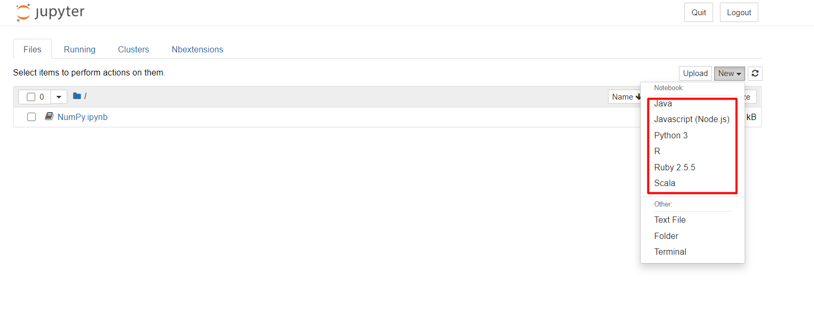

# Complete Data Science tools with Docker

This image expose jupyter in port **8888** with password **root**

  

## Supports

* Anaconda 3 2020
* Jupyter with Support for Autocomplete
* Python
* R
* Scala
* Java
* NodeJs
* Ruby

## Enable autocomplete

 - Click on nbextensions tab
 - Unckeck disable configuration for nbextensions without explicit compatibility
 - Put a check on Hinterland